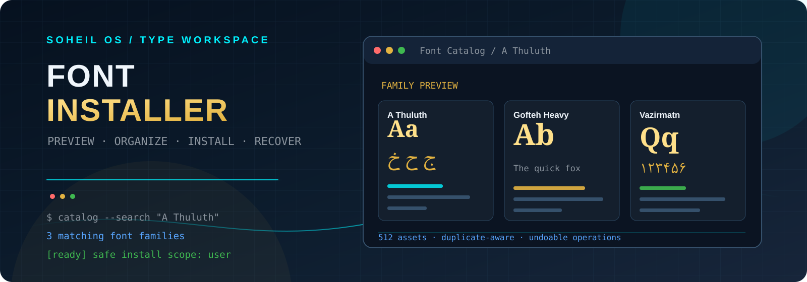

<div align="center">
  
  <h1>SOHEIL OS FONT INSTALLER</h1>
  <p><strong>A focused desktop workspace for discovering, previewing, organizing, and safely installing fonts.</strong></p>
  <p>
    <a href="https://www.python.org/"></a>
    <a href="https://www.riverbankcomputing.com/software/pyqt/"></a>
    
    
    <a href="https://github.com/Soheil-Aghayani/font-installer/releases/latest"></a>
  </p>
</div>

---

## The idea

Soheil OS Font Installer turns a folder of `.ttf` and `.otf` files into a searchable, visual font workspace. It keeps the speed and focus of a terminal workflow while adding previews, family-aware search, duplicate review, safe installation, backups, and undoable operations.

The repository includes a curated library of 512 font assets, including Persian and Arabic families, so the application can be useful immediately after cloning.

<table align="center">
  <tr>
    <td align="center">🔎<br><strong>Discover</strong><br><sub>Search names, families, and folders</sub></td>
    <td align="center">🎨<br><strong>Preview</strong><br><sub>Compare Latin and Arabic glyphs</sub></td>
    <td align="center">🛡️<br><strong>Protect</strong><br><sub>Validate, back up, and recover</sub></td>
    <td align="center">⚡<br><strong>Stay responsive</strong><br><sub>Batch loading and live progress</sub></td>
  </tr>
</table>

## The experience

| Area | What it does |
| --- | --- |
| **Terminal workflow** | Browse font families or root-level loose fonts, then use context-specific actions without leaving the command line. |
| **Visual catalog** | Search by family, filename, or folder; filter by status and format; group cards; select many fonts; and preview before installing. |
| **Preview studio** | Edit English and Persian/Arabic samples, change the live size, inspect glyph and symbol sheets, and use readable arrowless scrollbars for long samples. |
| **Side-by-side comparison** | Compare two font files with matching sample text, sizing, and glyph views. |
| **Duplicate manager** | Find byte-identical asset copies, keep a protected canonical copy, and remove extras only after selecting them. |
| **Safe installation** | Install to User or System scope, refuse same-name conflicts, and only report a font as already installed when it matches in the requested scope. |
| **Recovery tools** | Back up removed files, record operations, and undo the newest reversible change without replacing files that have changed since the original operation. |
| **Responsive feedback** | Use a persistent index, cached family metadata, batched lists, incremental catalog cards, and in-dialog progress updates. |

## Download

Download the latest Windows executable from the [GitHub Releases page](https://github.com/Soheil-Aghayani/font-installer/releases/latest). The release includes `installer.exe`, a self-contained build with the bundled font library.

## Run locally

Clone the repository and create a virtual environment:

```bash
git clone https://github.com/Soheil-Aghayani/font-installer.git
cd font-installer
python -m venv .venv
```

Activate the environment:

```powershell
# Windows
.venv\Scripts\activate
```

```bash
# macOS / Linux
source .venv/bin/activate
```

Install the dependencies and start the application:

```bash
python -m pip install -r requirements.txt
python installer.py
```

The bundled `asset/` directory is the default font library. The application does not modify installed system fonts until you explicitly run an install or sync operation.

## The command flow

### Global commands

| Command | Purpose |
| --- | --- |
| `list` | Browse font family folders and the `Loose Fonts` group. |
| `catalog` | Open the visual catalog. |
| `search <text>` | Open the catalog with a family, filename, or folder search already applied. |
| `sync [--user or --system]` | Install only missing fonts for the selected scope. |
| `duplicates` | Review and clean up byte-identical asset copies. |
| `undo` / `history` | Reverse or inspect recent reversible operations. |
| `audit` / `sys-audit` | Compare assets with installed fonts, or find installed fonts outside the asset library. |
| `sys-list` | List installed system font families. |
| `validate` | Check asset font files before installation. |
| `scope <user or system>` | Set the default installation scope. |
| `theme <name>` | Change the terminal theme. |
| `set-text <per or eng> <text>` | Set custom preview text. |
| `cancel` / `exit` | Stop an active background operation or close the application. |

### Font-selection actions

After `list`, select a family or `Loose Fonts` group. These actions are intentionally available only in that font-selection view:

```text
preview 1
info 1
compare 1 2
install 1 3 --system
uninstall 1
back
```

The contextual `help` output follows the same flow. A plain number in a font view is treated as an invalid font action instead of accidentally dispatching a global command.

## Safety and recovery

> [!WARNING]
> System-scope installation may require administrator privileges. User scope is the default.

- Font files are structurally validated before installation.
- Copies are written atomically and different same-name files are never overwritten.
- Installation idempotence is checked against the requested User or System scope.
- Uninstall removes only installed files whose contents match the selected asset.
- Duplicate asset removal creates a backup before deleting the selected extra copy.
- Operation history and backups support safe undo workflows.
- The persistent index uses file size, modification time, and SHA-256 content hashes to speed up repeated scans.

Backups, operation history, and the font index are stored in the platform's per-user application-data directory, outside the packaged executable.

## Project map

| Path | Responsibility |
| --- | --- |
| [`installer.py`](installer.py) | PyQt5 terminal UI, catalog, previews, comparisons, commands, and background workers. |
| [`font_manager.py`](font_manager.py) | Font discovery, validation, hashing, installation, uninstall, backups, indexing, and undo data. |
| [`tests/test_font_manager.py`](tests/test_font_manager.py) | Unit coverage for safe file operations, scope behavior, duplicates, backups, and undo. |
| [`asset/`](asset/) | Bundled TrueType and OpenType font library. |
| [`installer.spec`](installer.spec) | PyInstaller build configuration that bundles the asset library. |
| [`config.json`](config.json) | Default theme, preview samples, and installation scope. |

## Build a standalone executable

Install the development dependencies and build with the supplied spec:

```powershell
python -m pip install -r requirements.txt
pyinstaller installer.spec
```

On Windows, the packaged executable is written under `dist/`. The spec includes the full `asset/` directory so the visual catalog remains available in the packaged build.

## Test

Run the manager tests with:

```powershell
python -m unittest discover -s tests -v
```

The test suite covers idempotent installation, User/System scope separation, conflict protection, hash-checked uninstall, duplicate handling, backup restoration, undo safety, persistent indexing, and invalid-file rejection.

## Font licensing

The `asset/` directory contains third-party font files. Before redistributing this repository or a packaged build, review and retain the license terms for each included font. The application code does not grant redistribution rights for bundled fonts.

## Contributing

Contributions are welcome. Keep the terminal workflow clear and context-aware, preserve safe file-operation behavior, and include tests for changes to installation, duplicate, backup, or undo logic. For UI changes, verify narrow-window layouts, loading states, and both Latin and Persian/Arabic previews.

Open an issue for a proposal or submit a pull request with a concise description and validation notes.

---

<div align="center">
  <sub>Built with Python, PyQt5, careful file operations, and a large appreciation for good type.</sub>
</div>
